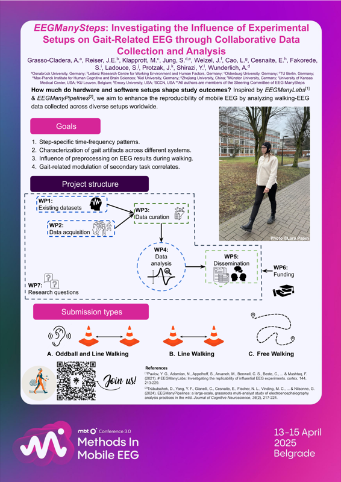
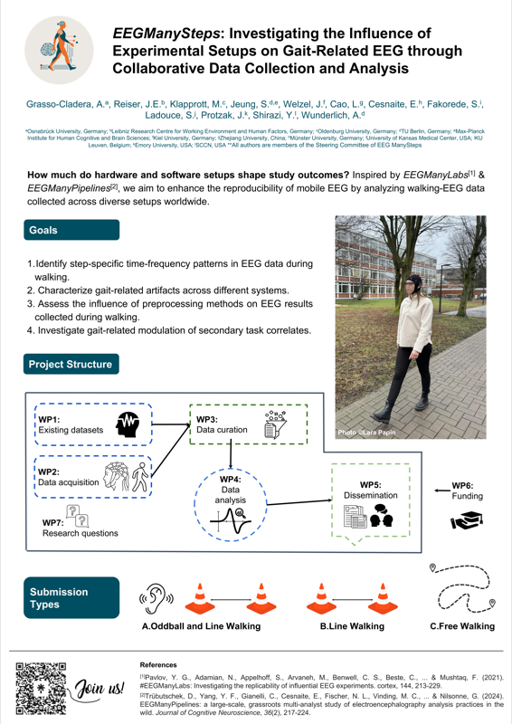

Conference posters and presentations from the EEGManySteps initiative. Click on a poster thumbnail to view the full-resolution PDF.

::: {.callout-note}
If you presented an EEGManySteps poster, please share it via a [pull request](https://github.com/EEGManySteps/eegmanysteps.github.io/pulls) or email [eegmanysteps@gmail.com](mailto:eegmanysteps@gmail.com).
:::

## Methods in Mobile EEG (MBT) 2025 -- Belgrade, April 2025

[{width=80%}](./files/posters/poster_mbt_2025.pdf)

Grasso-Cladera, A., Reiser, J.E., Klapprott, M., Jung, S., Welzel, J., Cao, L., Cesnaite, E., Fakorede, S., Ladouce, S., Protzak, J., Shirazi, Y., Wunderlich, A.

---

## Psychologie und Gehirn (PuG) 2025

[{width=80%}](./files/posters/poster_pug_2025.pdf)

Grasso-Cladera, A., Reiser, J.E., Klapprott, M., Jeung, S., Welzel, J., Cao, L., Cesnaite, E., Fakorede, S., Ladouce, S., Protzak, J., Shirazi, Y., Wunderlich, A.
